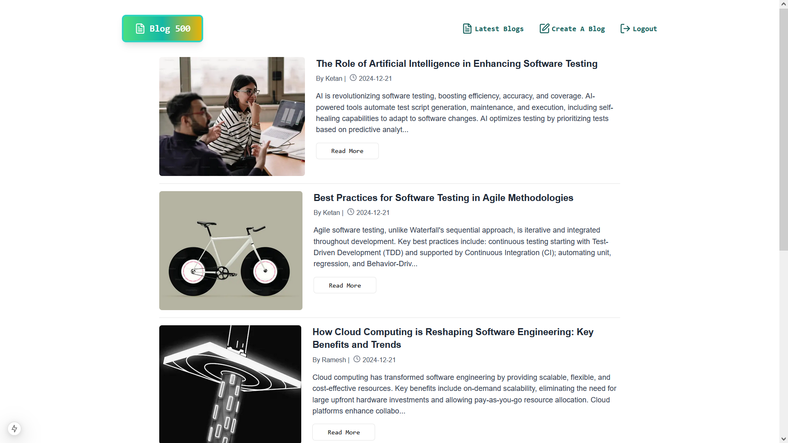
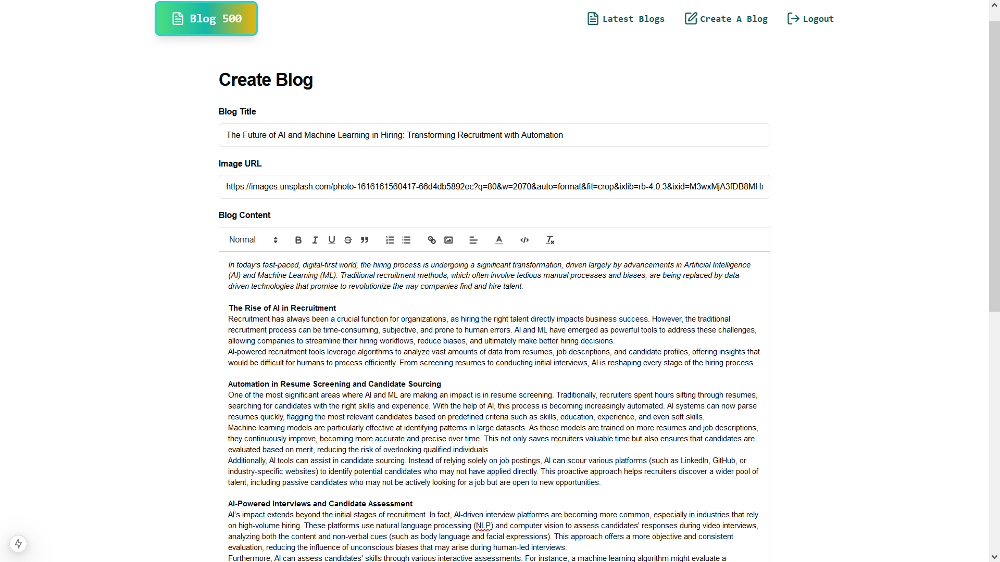
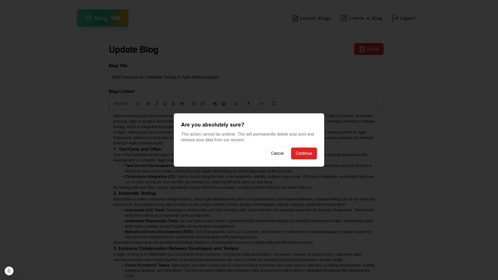
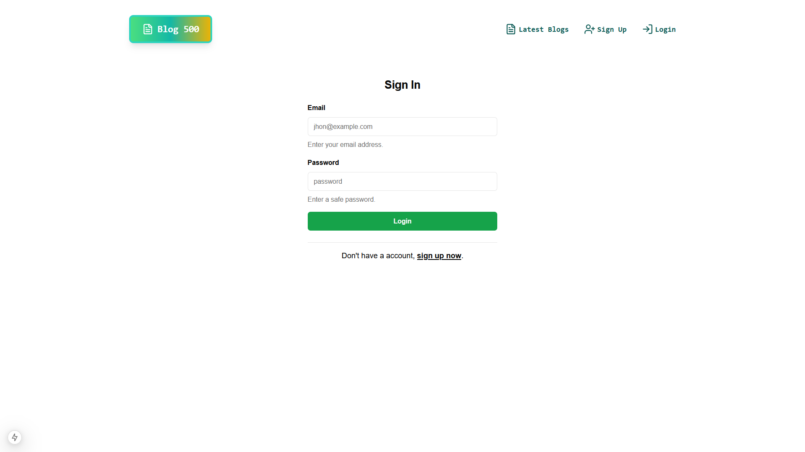
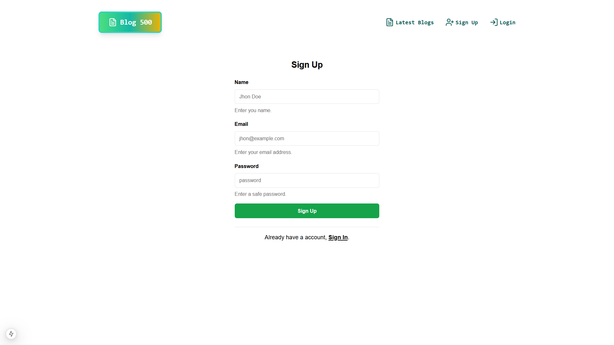
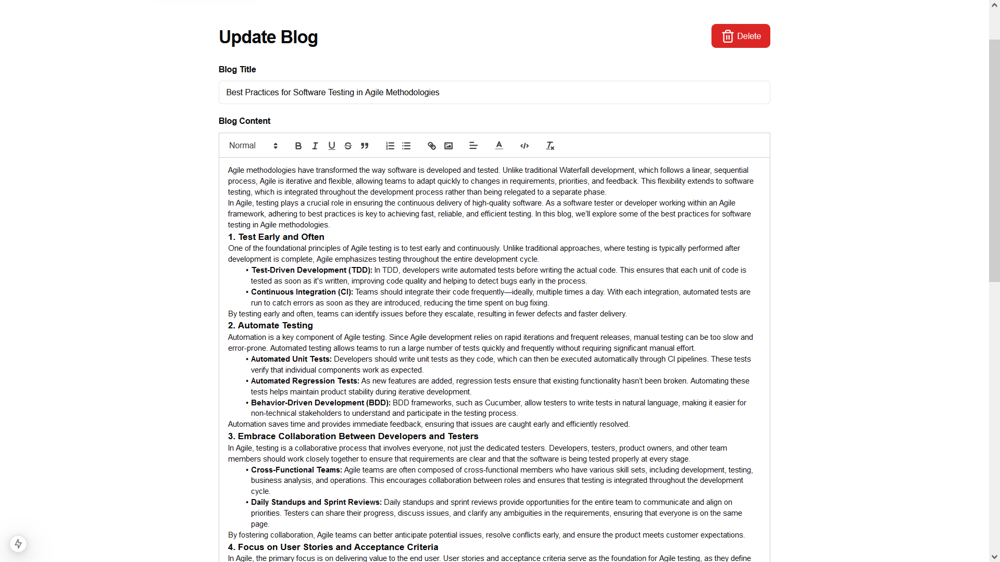
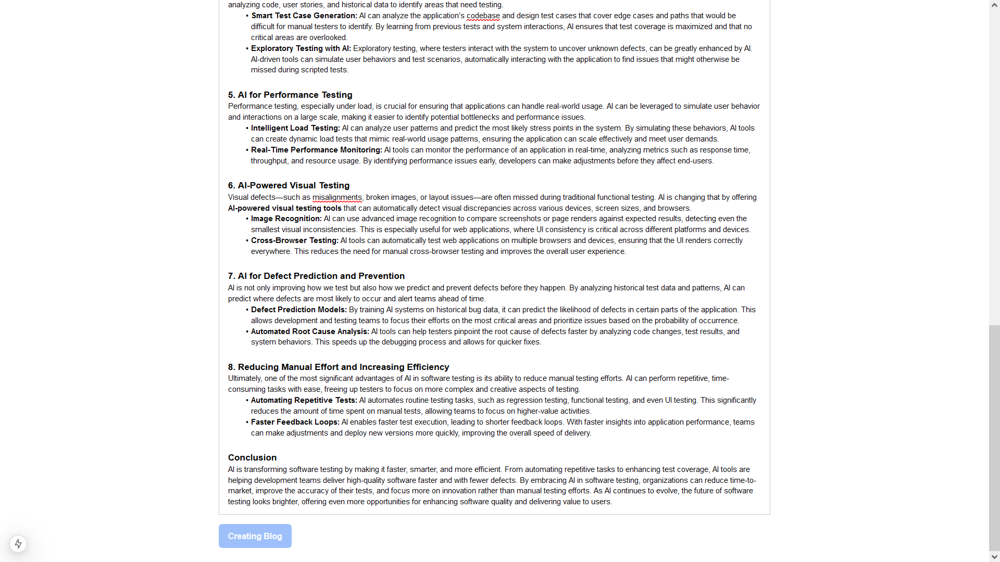

# 🌟 AI Powered Blogging Platform

Welcome to the **AI Powered Blogging Platform**! This project combines cutting-edge artificial intelligence with modern web development to provide an intuitive, feature-rich platform for bloggers. From intelligent content generation to seamless user authentication, this platform empowers creators to enhance their blogging experience.

---

## 📚 Table of Contents

1. 🚀 Key Features
2. 🖼️ Visual Overview
3. 📂 Project Structure
4. 🛠️ Dev Setup
5. 🏗️ Build / Production Setup
6. 🔧 Technologies Used
7. 🤖 AI Integration
8. 🌐 Frontend-Backend Integration

---

## 🚀 1.Key Features

- **🤖 AI-Generated Blog Summaries**: Automatically generates concise and insightful summaries for blog posts using advanced AI algorithms.
- **🔑 AI-Selected Keywords**: Leverages AI to intelligently select impactful keywords, boosting SEO and content discoverability.
- **🔒 Secure Custom Authentication**: Built a robust authentication system with Argon2 password hashing and JWT for safe, seamless login.
- **👥 Multi-User Support**: Enables multiple users to interact, share, and engage on the platform, similar to a social media experience.
- **📦 MongoDB Integration with Mongoose**: Efficient data management with MongoDB, using Mongoose for structured interaction.
- **💻 Full TypeScript Integration**: Developed using TypeScript to ensure type safety, reducing errors and improving maintainability.
- **✍️ QuillJS WYSIWYG Editor**: Provides an intuitive, feature-rich text editor for smooth content creation.
- **📈 SEO-Optimized SSR**: Server-side rendering for better SEO and faster page loads, with dynamic meta-data generation.
- **⚡ Powered by Next.js (v15.2.xx)**: Built with the latest Next.js for exceptional performance and scalability.
- **📡 Axios for API Calls**: Centralized API management using Axios for consistent and efficient communication with the backend.
- **🛡️ JWT Authentication**: Secure and scalable user authentication with JSON Web Tokens.
- **🎨 TailwindCSS Styling**: Elegant and responsive design crafted with TailwindCSS for a modern UI.
- **📋 React Hook Form & Zod Validation**: Optimized form handling and type-safe validation across frontend and backend.
- **⚙️ Express.js Backend**: Express-powered backend with TypeScript, ensuring a smooth interaction with MongoDB.
- **🎨 Custom Frontend Design**: Fully personalized frontend UI, tailored to the platform's needs.
- **🛠️ Development with Nodemon**: Nodemon setup for an efficient development workflow with automatic server restarts.

---

### 🖼️ 2. Visual Overview

Experience the platform with visual snapshots of key features:

- **AI Summarization for Blogs**  
     Experience how the AI summarizes blog content to provide concise overviews.  
     

- **Home Page**  
  The main landing page, showcasing the app’s features and navigation.  
  

- **Blog Page View**  
  How a finished blog looks once published.  
  

- **Create New Blog Page with Quill Editor**  
  The interface for creating new blogs using the Quill WYSIWYG editor.  
  

- **Delete Blog Warning**  
  A confirmation screen when deleting a blog post, ensuring users are cautious before deletion.  
  

- **Sign In Page**  
  The user login screen to access the app securely.  
  

- **Sign Up Page**  
  The registration screen for new users to sign up for the app.  
  

- **Update Blog Page**  
  The page interface for editing and updating existing blogs.  
  

- **Blog Creation Waiting Page**  
  A sneak peek of the waiting screen when creating a new blog.  
  

---

## 📂 3.Project Structure

The project is divided into two main sections: **Frontend** and **Backend**. Each section is designed for easy scalability and maintenance.

### **Frontend** 🌐

- **`frontend/`**: Contains all frontend-related code.
  - **`app/`**: Main application logic and page components.
  - **`components/`**: Reusable React components.
  - **`lib/`**: Helper libraries and functions.
  - **`public/`**: Static assets like images and fonts.
  - **`node_modules/`**: Frontend dependencies.
  - **`utils/`**: Utility functions for the frontend.

### **Backend** 🔙

- **`backend/`**: Contains all backend-related code.
  - **`src/`**: Source code for backend logic.
  - **`models/`**: MongoDB models and schemas.
  - **`controllers/`**: Request handling logic.
  - **`services/`**: Core business logic.
  - **`validation/`**: Zod-based data validation.
  - **`node_modules/`**: Backend dependencies.

---

## 🛠️ 4.Dev Setup

### Backend Environment Configuration

1. Clone the repository and install dependencies:

   ```bash
   npm install
   ```

2. Create a `.env` file in the **`backend/`** directory and configure environment variables as shown in **`env.example`**.

### Running the Project

- **Backend**:

  ```bash
  cd backend
  npm run dev
  ```

- **Frontend**:

  ```bash
  cd frontend
  npm run dev
  ```

---

## 🏗️ 5.Build / Production Setup

### Backend Production Setup

1. Set up the environment variables as per the `.env` file.
2. Build and start the backend:

   ```bash
   npm run build
   npm run start
   ```

### Frontend Production Setup

1. Build and start the frontend:

   ```bash
   npm run build
   npm run start
   ```

---

## 🔧 6.Technologies Used

### Frontend

- **React.js** 💻: Component-based UI for fast rendering.
- **Next.js** ⚡: SSR and SSG for improved SEO and performance.
- **Axios** 📡: Simplifies HTTP requests and responses.
- **TypeScript** 🛠️: Type safety for robust and error-free code.
- **TailwindCSS** 🎨: Modern, flexible styling for a clean UI.
- **React Hook Form** 📝: Optimized form handling and validation.
- **React-Quill** ✨: WYSIWYG editor for rich content creation.

### Backend

- **Express.js** 🖥️: Web framework for building APIs.
- **MongoDB** 📊: NoSQL database for flexible data storage.
- **JWT** 🛡️: Secure authentication and session management.
- **Zod** ✅: Type-safe schema validation.
- **Langchain** 🧠: Powers AI-driven features like content summarization and keyword extraction.

---

## 🤖 7. AI Integration

AI is at the heart of the platform, providing smart features like blog content summarization and automated keyword selection.

### Key AI Features

- **Content Summarization**: AI generates concise summaries for blogs using Google’s Gemini API.
- **Keyword Extraction**: Automatically identifies SEO-friendly keywords for each post.
- **User Interaction**: Users can interact with AI-generated content in the React-Quill editor, allowing easy customization.

---

## 🌐 8.Frontend-Backend Integration

Frontend and backend communicate seamlessly to provide a smooth user experience:

- **API Requests**: Axios is used for sending API requests from the frontend to the backend.
- **Authentication**: JWT tokens secure interactions between the frontend and backend.
- **Data Validation**: Zod ensures data integrity, validating inputs both on the frontend and backend.

This README highlights the best of the AI-powered blogging platform, from innovative AI features to cutting-edge web development practices. Ready to dive in? Clone the repo, set up your environment, and start blogging smarter today!